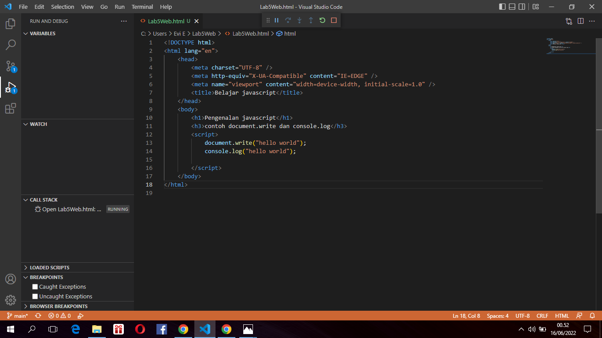
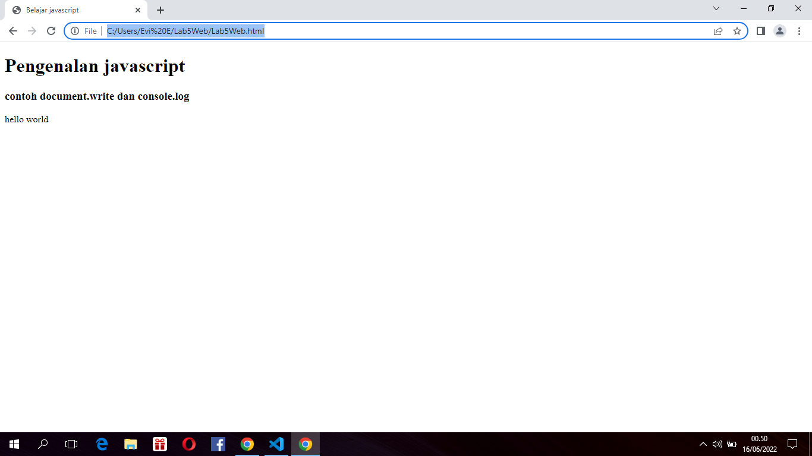
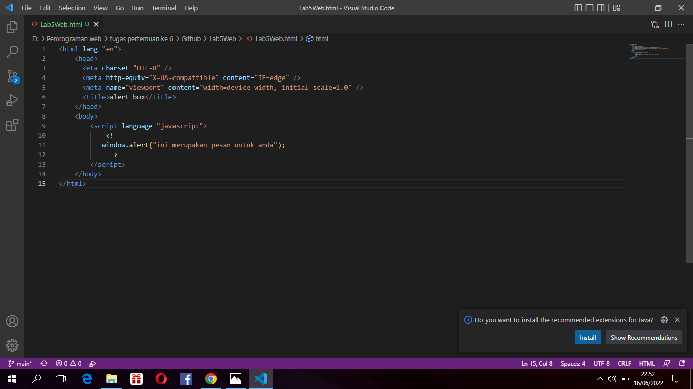
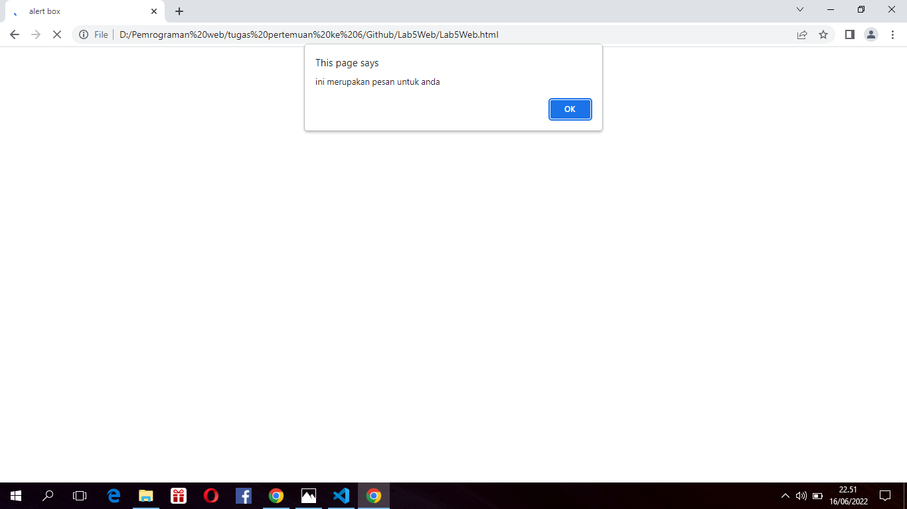

# Pratikum 5 Pemgrograman web

Repository ini dibuat untuk memenuhi tugas mata kuliah pemrograman web.

# Lab5web

Nama    : Aka erlanda

Nim     : 312010207

Kelas   : TI.20.B.1

<b>Langkah-langkah Praktikum</b>
Persiapan membuat dokumen HTML dengan nama file<b>lab5_javascript.html</b>seperti berikut.

<b>Berikut hasil nya :</b>

1. Javascript Dasar
Pemakaian Alert sebagai property window.

<b>Lalu jika dibuka hasilnya akan seperti ini :</b>

